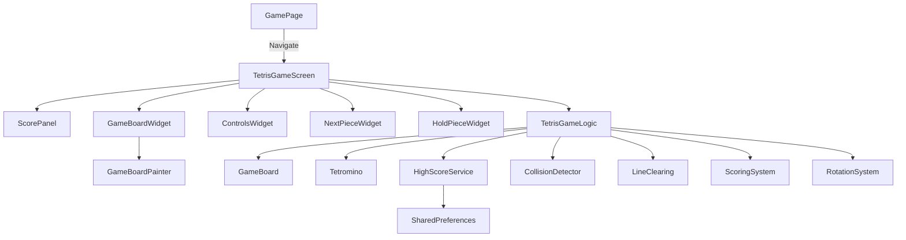
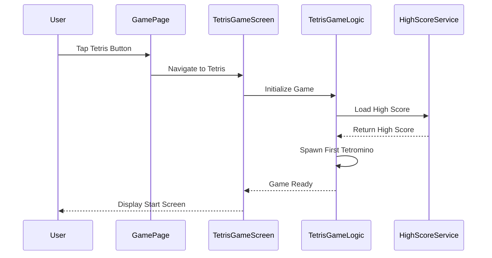
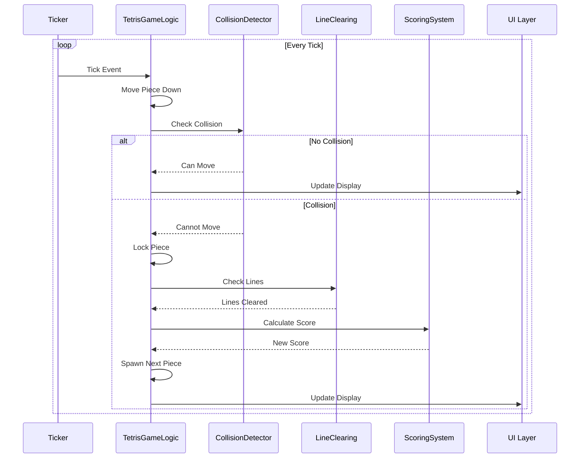

# Design Document: Tetris Game

## Overview

This design document describes a fully functional Tetris game implementation in Flutter that will be integrated into an existing game_page.dart. The game features standard Tetris mechanics including seven tetromino shapes, automatic falling with progressive difficulty, collision detection, line clearing with scoring, and persistent high score tracking. The architecture follows clean code principles with separation of concerns between UI rendering, game logic, and state management. The game operates entirely offline with local data persistence using SharedPreferences.

The implementation uses Flutter's CustomPainter for efficient grid rendering, AnimationController with Ticker for smooth falling animations, and a reactive state management approach. The UI is designed for mobile-first interaction with touch-friendly controls and responsive layouts that adapt to different screen sizes.

## Architecture



## Sequence Diagrams

### Game Initialization Flow



### Game Loop Flow




## Components and Interfaces

### Component 1: TetrisGameLogic

**Purpose**: Core game state management and business logic orchestration

**Interface**:
```dart
class TetrisGameLogic extends ChangeNotifier {
  // Game state
  GameState get currentState;
  GameBoard get board;
  Tetromino? get currentPiece;
  Tetromino? get nextPiece;
  Tetromino? get heldPiece;
  int get score;
  int get highScore;
  int get level;
  int get linesCleared;
  
  // Game control methods
  void startGame();
  void pauseGame();
  void resumeGame();
  void restartGame();
  void gameOver();
  
  // Piece control methods
  void movePieceLeft();
  void movePieceRight();
  void movePieceDown();
  void rotatePieceClockwise();
  void rotatePieceCounterClockwise();
  void hardDrop();
  void holdPiece();
  
  // Internal methods
  void _tick();
  void _lockPiece();
  void _spawnNextPiece();
  void _checkAndClearLines();
  void _updateScore(int linesCleared);
  void _updateLevel();
  bool _isGameOver();
}
```

**Responsibilities**:
- Manage game state transitions (start, pause, game over)
- Coordinate piece movement and rotation
- Handle collision detection through GameBoard
- Trigger line clearing and scoring
- Persist high scores
- Notify UI of state changes

### Component 2: GameBoard

**Purpose**: Represents the 10x20 game grid and handles collision detection

**Interface**:
```dart
class GameBoard {
  static const int width = 10;
  static const int height = 20;
  
  List<List<int?>> get grid;
  
  // Collision detection
  bool canPlacePiece(Tetromino piece, int x, int y);
  bool isValidPosition(int x, int y);
  
  // Board manipulation
  void lockPiece(Tetromino piece, int x, int y);
  List<int> getFullLines();
  void clearLines(List<int> lines);
  void reset();
  
  // Ghost piece calculation
  int calculateGhostY(Tetromino piece, int x, int y);
}
```

**Responsibilities**:
- Maintain grid state (10x20 cells)
- Validate piece positions
- Detect collisions with walls, floor, and locked pieces
- Lock pieces into the grid
- Identify and clear complete lines
- Calculate ghost piece preview position

### Component 3: Tetromino

**Purpose**: Represents individual tetromino pieces with shape and rotation

**Interface**:
```dart
class Tetromino {
  final TetrominoType type;
  final List<List<List<int>>> rotations;
  int currentRotation;
  
  Tetromino(this.type);
  
  List<List<int>> get currentShape;
  Color get color;
  
  void rotateClockwise();
  void rotateCounterClockwise();
  Tetromino clone();
  
  // Static factory methods
  static Tetromino random();
  static Tetromino fromType(TetrominoType type);
}

enum TetrominoType { I, O, T, S, Z, J, L }
```

**Responsibilities**:
- Store tetromino shape data for all rotations
- Handle rotation logic
- Provide color mapping for each type
- Generate random pieces

### Component 4: HighScoreService

**Purpose**: Persist and retrieve high score data locally

**Interface**:
```dart
class HighScoreService {
  static const String _highScoreKey = 'tetris_high_score';
  
  Future<int> getHighScore();
  Future<void> saveHighScore(int score);
  Future<void> clearHighScore();
}
```

**Responsibilities**:
- Load high score from SharedPreferences
- Save new high scores
- Handle storage errors gracefully

### Component 5: TetrisGameScreen

**Purpose**: Main UI container and layout orchestration

**Interface**:
```dart
class TetrisGameScreen extends StatefulWidget {
  const TetrisGameScreen({Key? key}) : super(key: key);
  
  @override
  State<TetrisGameScreen> createState() => _TetrisGameScreenState;
}

class _TetrisGameScreenState extends State<TetrisGameScreen> 
    with SingleTickerProviderStateMixin {
  late TetrisGameLogic _gameLogic;
  late AnimationController _animationController;
  
  @override
  Widget build(BuildContext context);
  
  void _handleTick();
  void _showPauseDialog();
  void _showGameOverDialog();
}
```

**Responsibilities**:
- Manage animation controller for game loop
- Layout UI components (score panel, game board, controls)
- Handle game state dialogs (pause, game over)
- Coordinate user input with game logic

### Component 6: GameBoardWidget

**Purpose**: Render the game grid using CustomPainter

**Interface**:
```dart
class GameBoardWidget extends StatelessWidget {
  final GameBoard board;
  final Tetromino? currentPiece;
  final int pieceX;
  final int pieceY;
  final bool showGhost;
  
  const GameBoardWidget({
    required this.board,
    this.currentPiece,
    required this.pieceX,
    required this.pieceY,
    this.showGhost = true,
    Key? key,
  }) : super(key: key);
  
  @override
  Widget build(BuildContext context);
}

class GameBoardPainter extends CustomPainter {
  final GameBoard board;
  final Tetromino? currentPiece;
  final int pieceX;
  final int pieceY;
  final int ghostY;
  
  @override
  void paint(Canvas canvas, Size size);
  
  @override
  bool shouldRepaint(GameBoardPainter oldDelegate);
}
```

**Responsibilities**:
- Efficiently render 10x20 grid
- Draw locked pieces with colors
- Draw current falling piece
- Draw ghost piece preview
- Handle responsive sizing


## Data Models

### Model 1: GameState

```dart
enum GameState {
  start,      // Initial state, showing start screen
  playing,    // Active gameplay
  paused,     // Game paused
  gameOver    // Game ended
}
```

**Validation Rules**:
- State transitions must follow valid flow: start → playing → paused → playing → gameOver
- Cannot transition from gameOver to paused
- Can restart from any state to start

### Model 2: TetrominoShape

```dart
class TetrominoShape {
  // I-piece (Cyan)
  static const List<List<List<int>>> I = [
    [[0,0,0,0], [1,1,1,1], [0,0,0,0], [0,0,0,0]],
    [[0,0,1,0], [0,0,1,0], [0,0,1,0], [0,0,1,0]],
    [[0,0,0,0], [0,0,0,0], [1,1,1,1], [0,0,0,0]],
    [[0,1,0,0], [0,1,0,0], [0,1,0,0], [0,1,0,0]]
  ];
  
  // O-piece (Yellow)
  static const List<List<List<int>>> O = [
    [[1,1], [1,1]],
    [[1,1], [1,1]],
    [[1,1], [1,1]],
    [[1,1], [1,1]]
  ];
  
  // T-piece (Purple)
  static const List<List<List<int>>> T = [
    [[0,1,0], [1,1,1], [0,0,0]],
    [[0,1,0], [0,1,1], [0,1,0]],
    [[0,0,0], [1,1,1], [0,1,0]],
    [[0,1,0], [1,1,0], [0,1,0]]
  ];
  
  // S-piece (Green)
  static const List<List<List<int>>> S = [
    [[0,1,1], [1,1,0], [0,0,0]],
    [[0,1,0], [0,1,1], [0,0,1]],
    [[0,0,0], [0,1,1], [1,1,0]],
    [[1,0,0], [1,1,0], [0,1,0]]
  ];
  
  // Z-piece (Red)
  static const List<List<List<int>>> Z = [
    [[1,1,0], [0,1,1], [0,0,0]],
    [[0,0,1], [0,1,1], [0,1,0]],
    [[0,0,0], [1,1,0], [0,1,1]],
    [[0,1,0], [1,1,0], [1,0,0]]
  ];
  
  // J-piece (Blue)
  static const List<List<List<int>>> J = [
    [[1,0,0], [1,1,1], [0,0,0]],
    [[0,1,1], [0,1,0], [0,1,0]],
    [[0,0,0], [1,1,1], [0,0,1]],
    [[0,1,0], [0,1,0], [1,1,0]]
  ];
  
  // L-piece (Orange)
  static const List<List<List<int>>> L = [
    [[0,0,1], [1,1,1], [0,0,0]],
    [[0,1,0], [0,1,0], [0,1,1]],
    [[0,0,0], [1,1,1], [1,0,0]],
    [[1,1,0], [0,1,0], [0,1,0]]
  ];
}
```

**Validation Rules**:
- Each shape must have exactly 4 rotation states
- Each rotation must be a valid 2D matrix
- Matrix dimensions must accommodate the piece (4x4 for I, 2x2 for O, 3x3 for others)

### Model 3: ScoreData

```dart
class ScoreData {
  final int currentScore;
  final int highScore;
  final int level;
  final int linesCleared;
  final int linesClearedThisLevel;
  
  const ScoreData({
    required this.currentScore,
    required this.highScore,
    required this.level,
    required this.linesCleared,
    required this.linesClearedThisLevel,
  });
  
  ScoreData copyWith({
    int? currentScore,
    int? highScore,
    int? level,
    int? linesCleared,
    int? linesClearedThisLevel,
  });
}
```

**Validation Rules**:
- currentScore >= 0
- highScore >= currentScore (updated when currentScore exceeds it)
- level >= 1
- linesCleared >= 0
- linesClearedThisLevel >= 0 and < 10 (resets every 10 lines)

### Model 4: TetrominoColors

```dart
class TetrominoColors {
  static const Map<TetrominoType, Color> colors = {
    TetrominoType.I: Color(0xFF00FFFF), // Cyan
    TetrominoType.O: Color(0xFFFFFF00), // Yellow
    TetrominoType.T: Color(0xFF800080), // Purple
    TetrominoType.S: Color(0xFF00FF00), // Green
    TetrominoType.Z: Color(0xFFFF0000), // Red
    TetrominoType.J: Color(0xFF0000FF), // Blue
    TetrominoType.L: Color(0xFFFF7F00), // Orange
  };
  
  static Color getColor(TetrominoType type) => colors[type]!;
  static Color getGhostColor(TetrominoType type) => 
      colors[type]!.withOpacity(0.3);
}
```

**Validation Rules**:
- All seven tetromino types must have assigned colors
- Colors must be distinct and visually distinguishable
- Ghost colors must have reduced opacity (0.2-0.4)


## Key Functions with Formal Specifications

### Function 1: canPlacePiece()

```dart
bool canPlacePiece(Tetromino piece, int x, int y)
```

**Preconditions:**
- `piece` is non-null and has valid currentShape
- `x` and `y` are integer coordinates
- `piece.currentShape` is a valid 2D matrix

**Postconditions:**
- Returns `true` if and only if the piece can be placed at (x, y) without collision
- Returns `false` if any cell of the piece overlaps with:
  - Grid boundaries (x < 0, x + width > 10, y < 0, y + height > 20)
  - Locked pieces (grid[y][x] != null)
- No mutations to game state

**Loop Invariants:**
- For each row checked: all previously checked rows had valid positions
- Grid state remains unchanged throughout validation

### Function 2: lockPiece()

```dart
void lockPiece(Tetromino piece, int x, int y)
```

**Preconditions:**
- `piece` is non-null with valid currentShape
- `canPlacePiece(piece, x, y)` returns `true`
- (x, y) is within valid grid bounds
- All target cells in grid are currently empty

**Postconditions:**
- All non-zero cells of piece.currentShape are written to grid at offset (x, y)
- Grid cells contain the TetrominoType value for rendering
- Piece is permanently fixed in the grid
- No other grid cells are modified

**Loop Invariants:**
- All previously locked cells remain unchanged
- Only cells corresponding to piece shape are modified

### Function 3: clearLines()

```dart
List<int> clearLines()
```

**Preconditions:**
- Grid is in valid state (10x20 dimensions)
- All grid cells contain either null or valid TetrominoType

**Postconditions:**
- Returns list of line indices that were cleared (0-19)
- All complete lines (all 10 cells filled) are removed
- Lines above cleared lines shift down by number of cleared lines
- Empty lines added at top
- Grid maintains 10x20 dimensions
- Returns empty list if no lines were complete

**Loop Invariants:**
- For line checking: all previously checked lines maintain their state
- For line shifting: all lines above current position remain in correct relative order
- Grid width remains constant at 10

### Function 4: rotatePieceClockwise()

```dart
void rotatePieceClockwise()
```

**Preconditions:**
- `currentPiece` is non-null
- `currentPiece` has valid rotation states
- Game is in playing state

**Postconditions:**
- If rotation is valid (no collision): piece rotation index increments (mod 4)
- If rotation causes collision: attempt wall kicks (SRS system)
- If all wall kicks fail: rotation is cancelled, piece remains unchanged
- Piece position may be adjusted by wall kick offset
- notifyListeners() is called if state changed

**Loop Invariants:**
- Original piece state preserved until valid rotation confirmed
- Wall kick attempts maintain piece integrity

### Function 5: calculateScore()

```dart
int calculateScore(int linesCleared, int currentLevel)
```

**Preconditions:**
- `linesCleared` is in range [0, 4]
- `currentLevel` >= 1
- Current score >= 0

**Postconditions:**
- Returns score increment based on lines cleared and level
- Score formula: baseScore * level
  - 1 line: 100 * level
  - 2 lines: 300 * level
  - 3 lines: 500 * level
  - 4 lines (Tetris): 800 * level
- Returns 0 if linesCleared is 0
- No side effects on game state

**Loop Invariants:** N/A (no loops)

### Function 6: updateLevel()

```dart
void updateLevel()
```

**Preconditions:**
- `linesCleared` >= 0
- `level` >= 1
- Game is in playing or paused state

**Postconditions:**
- Level increments by 1 for every 10 lines cleared
- Fall speed increases with level: baseSpeed / level
- linesClearedThisLevel resets to 0 when level increases
- Animation controller duration updated to new fall speed
- notifyListeners() called if level changed

**Loop Invariants:** N/A (no loops)

### Function 7: hardDrop()

```dart
void hardDrop()
```

**Preconditions:**
- `currentPiece` is non-null
- Game is in playing state
- Current piece is at valid position

**Postconditions:**
- Piece immediately moves to lowest valid Y position
- Score increases by (distance dropped * 2)
- Piece is locked at final position
- Line clearing triggered
- Next piece spawned
- If spawn fails, game over triggered
- notifyListeners() called

**Loop Invariants:**
- During Y position search: piece remains at valid positions
- Grid state unchanged until final lock

### Function 8: holdPiece()

```dart
void holdPiece()
```

**Preconditions:**
- `currentPiece` is non-null
- Game is in playing state
- Hold has not been used since last piece lock (holdUsedThisTurn == false)

**Postconditions:**
- If heldPiece is null: currentPiece moves to hold, spawn next piece
- If heldPiece exists: swap currentPiece with heldPiece
- Swapped piece resets to rotation 0 and spawns at top center
- holdUsedThisTurn set to true
- notifyListeners() called

**Loop Invariants:** N/A (no loops)


## Algorithmic Pseudocode

### Main Game Loop Algorithm

```dart
void _tick() {
  ASSERT currentState == GameState.playing
  ASSERT currentPiece != null
  
  // Calculate time-based fall speed
  final fallInterval = _calculateFallInterval(level);
  
  IF elapsed time >= fallInterval THEN
    // Attempt to move piece down
    final newY = pieceY + 1;
    
    IF board.canPlacePiece(currentPiece!, pieceX, newY) THEN
      // Piece can move down
      pieceY = newY;
      notifyListeners();
    ELSE
      // Piece cannot move - lock it
      _lockPiece();
      
      // Check for line clears
      final clearedLines = board.clearLines();
      
      IF clearedLines.isNotEmpty THEN
        _updateScore(clearedLines.length);
        _updateLevel();
      END IF
      
      // Spawn next piece
      _spawnNextPiece();
      
      // Check game over condition
      IF NOT board.canPlacePiece(currentPiece!, pieceX, pieceY) THEN
        _gameOver();
      END IF
      
      notifyListeners();
    END IF
    
    // Reset timer
    lastTickTime = currentTime;
  END IF
}
```

**Preconditions:**
- Game is in playing state
- currentPiece exists and is valid
- AnimationController is active
- Board is in valid state

**Postconditions:**
- Piece has moved down by 1 if possible
- OR piece is locked and new piece spawned
- Score and level updated if lines cleared
- Game over triggered if spawn fails
- UI notified of all state changes

**Loop Invariants:**
- Game state remains consistent throughout tick
- Board dimensions remain 10x20
- Only one piece is active at a time

### Collision Detection Algorithm

```dart
bool canPlacePiece(Tetromino piece, int x, int y) {
  ASSERT piece != null
  ASSERT piece.currentShape is valid 2D matrix
  
  final shape = piece.currentShape;
  final rows = shape.length;
  final cols = shape[0].length;
  
  // Check each cell of the piece
  FOR row = 0 TO rows - 1 DO
    ASSERT all previously checked rows were valid
    
    FOR col = 0 TO cols - 1 DO
      IF shape[row][col] != 0 THEN
        // This cell is part of the piece
        final gridX = x + col;
        final gridY = y + row;
        
        // Check boundaries
        IF gridX < 0 OR gridX >= BOARD_WIDTH THEN
          RETURN false;
        END IF
        
        IF gridY < 0 OR gridY >= BOARD_HEIGHT THEN
          RETURN false;
        END IF
        
        // Check collision with locked pieces
        IF grid[gridY][gridX] != null THEN
          RETURN false;
        END IF
      END IF
    END FOR
  END FOR
  
  // All checks passed
  RETURN true;
}
```

**Preconditions:**
- piece is non-null with valid currentShape
- x and y are integer coordinates
- grid is initialized and valid

**Postconditions:**
- Returns true if piece can be placed without collision
- Returns false if any collision detected
- No mutations to game state
- Early termination on first collision found

**Loop Invariants:**
- All previously checked cells were valid (no collision)
- Grid state unchanged
- Piece shape unchanged

### Line Clearing Algorithm

```dart
List<int> clearLines() {
  ASSERT grid.length == BOARD_HEIGHT
  ASSERT grid[0].length == BOARD_WIDTH
  
  List<int> linesToClear = [];
  
  // Step 1: Identify complete lines
  FOR y = 0 TO BOARD_HEIGHT - 1 DO
    ASSERT all previously checked lines maintain state
    
    bool isComplete = true;
    
    FOR x = 0 TO BOARD_WIDTH - 1 DO
      IF grid[y][x] == null THEN
        isComplete = false;
        BREAK;
      END IF
    END FOR
    
    IF isComplete THEN
      linesToClear.add(y);
    END IF
  END FOR
  
  // Step 2: Remove complete lines and shift down
  IF linesToClear.isEmpty THEN
    RETURN linesToClear;
  END IF
  
  // Sort lines in descending order to clear from bottom up
  linesToClear.sort((a, b) => b.compareTo(a));
  
  FOR EACH lineIndex IN linesToClear DO
    ASSERT lineIndex >= 0 AND lineIndex < BOARD_HEIGHT
    
    // Remove the line
    grid.removeAt(lineIndex);
    
    // Add empty line at top
    grid.insert(0, List.filled(BOARD_WIDTH, null));
  END FOR
  
  ASSERT grid.length == BOARD_HEIGHT
  ASSERT grid[0].length == BOARD_WIDTH
  
  RETURN linesToClear;
}
```

**Preconditions:**
- grid is valid 10x20 matrix
- All grid cells contain null or valid TetrominoType

**Postconditions:**
- Returns list of cleared line indices
- Complete lines removed from grid
- Lines above shifted down
- Empty lines added at top
- Grid maintains 10x20 dimensions
- Grid state consistent

**Loop Invariants:**
- During identification: unchecked lines remain unchanged
- During clearing: grid height maintained after each removal
- Relative order of non-cleared lines preserved

### Rotation with Wall Kick Algorithm (SRS)

```dart
void rotatePieceClockwise() {
  ASSERT currentPiece != null
  ASSERT currentState == GameState.playing
  
  // Save original state
  final originalRotation = currentPiece!.currentRotation;
  final originalX = pieceX;
  final originalY = pieceY;
  
  // Attempt rotation
  currentPiece!.rotateClockwise();
  
  // Check if rotation is valid at current position
  IF board.canPlacePiece(currentPiece!, pieceX, pieceY) THEN
    // Rotation successful
    notifyListeners();
    RETURN;
  END IF
  
  // Try wall kicks (SRS system)
  final wallKicks = _getWallKicks(originalRotation, currentPiece!.type);
  
  FOR EACH offset IN wallKicks DO
    final testX = originalX + offset.dx;
    final testY = originalY + offset.dy;
    
    IF board.canPlacePiece(currentPiece!, testX, testY) THEN
      // Wall kick successful
      pieceX = testX;
      pieceY = testY;
      notifyListeners();
      RETURN;
    END IF
  END FOR
  
  // All attempts failed - revert rotation
  currentPiece!.currentRotation = originalRotation;
  
  // No notification needed - state unchanged
}
```

**Preconditions:**
- currentPiece is non-null
- Game is in playing state
- Piece is at valid position before rotation

**Postconditions:**
- If successful: piece rotated and possibly repositioned
- If failed: piece state unchanged
- notifyListeners() called only if state changed
- Piece remains at valid position

**Loop Invariants:**
- Original state preserved until valid rotation found
- Each wall kick attempt maintains piece integrity
- Grid state unchanged throughout

### Score Calculation Algorithm

```dart
int calculateScore(int linesCleared, int currentLevel) {
  ASSERT linesCleared >= 0 AND linesCleared <= 4
  ASSERT currentLevel >= 1
  
  // Base scores for line clears
  const baseScores = {
    0: 0,
    1: 100,    // Single
    2: 300,    // Double
    3: 500,    // Triple
    4: 800,    // Tetris
  };
  
  final baseScore = baseScores[linesCleared]!;
  final scoreIncrement = baseScore * currentLevel;
  
  RETURN scoreIncrement;
}
```

**Preconditions:**
- linesCleared in range [0, 4]
- currentLevel >= 1

**Postconditions:**
- Returns score increment (not total score)
- Score scales linearly with level
- Returns 0 if no lines cleared
- No side effects

**Loop Invariants:** N/A (no loops)

### Ghost Piece Calculation Algorithm

```dart
int calculateGhostY(Tetromino piece, int x, int y) {
  ASSERT piece != null
  ASSERT board.canPlacePiece(piece, x, y) == true
  
  int ghostY = y;
  
  // Move down until collision
  WHILE board.canPlacePiece(piece, x, ghostY + 1) DO
    ASSERT ghostY < BOARD_HEIGHT
    ghostY = ghostY + 1;
  END WHILE
  
  ASSERT ghostY >= y
  ASSERT NOT board.canPlacePiece(piece, x, ghostY + 1)
  
  RETURN ghostY;
}
```

**Preconditions:**
- piece is non-null and valid
- (x, y) is current valid position
- piece can be placed at (x, y)

**Postconditions:**
- Returns lowest valid Y position for piece at X
- ghostY >= y (never above current position)
- piece cannot move further down from ghostY
- No mutations to game state

**Loop Invariants:**
- ghostY represents valid position at each iteration
- ghostY increases monotonically
- Grid state unchanged


### Level Progression Algorithm

```dart
void updateLevel() {
  ASSERT linesCleared >= 0
  ASSERT level >= 1
  
  // Calculate new level based on total lines cleared
  final newLevel = (linesCleared ~/ 10) + 1;
  
  IF newLevel > level THEN
    level = newLevel;
    
    // Update fall speed
    final newFallInterval = _calculateFallInterval(level);
    _animationController.duration = Duration(milliseconds: newFallInterval);
    
    // Reset level progress
    linesClearedThisLevel = linesCleared % 10;
    
    notifyListeners();
  END IF
}

int _calculateFallInterval(int level) {
  ASSERT level >= 1
  
  // Base fall speed: 1000ms at level 1
  // Speed increases by reducing interval
  const baseFallSpeed = 1000;
  const minFallSpeed = 100;
  
  // Formula: max(minSpeed, baseSpeed - (level - 1) * 50)
  final interval = baseFallSpeed - ((level - 1) * 50);
  
  RETURN max(minFallSpeed, interval);
}
```

**Preconditions:**
- linesCleared >= 0
- level >= 1
- AnimationController is initialized

**Postconditions:**
- Level updated if threshold crossed (every 10 lines)
- Fall speed increased with level
- Fall speed never below minimum (100ms)
- linesClearedThisLevel reset on level up
- notifyListeners() called if level changed

**Loop Invariants:** N/A (no loops)

### Piece Spawning Algorithm

```dart
void _spawnNextPiece() {
  ASSERT nextPiece != null
  
  // Move next piece to current
  currentPiece = nextPiece;
  
  // Generate new next piece
  nextPiece = Tetromino.random();
  
  // Reset position to spawn point (top center)
  pieceX = (BOARD_WIDTH ~/ 2) - (currentPiece!.currentShape[0].length ~/ 2);
  pieceY = 0;
  
  // Reset hold flag
  holdUsedThisTurn = false;
  
  // Check if spawn position is valid
  IF NOT board.canPlacePiece(currentPiece!, pieceX, pieceY) THEN
    // Game over - cannot spawn
    _gameOver();
    RETURN;
  END IF
  
  notifyListeners();
}
```

**Preconditions:**
- nextPiece is non-null
- Previous piece has been locked
- Board is in valid state

**Postconditions:**
- currentPiece set to previous nextPiece
- New random nextPiece generated
- Piece positioned at top center
- holdUsedThisTurn reset to false
- If spawn fails, game over triggered
- notifyListeners() called

**Loop Invariants:** N/A (no loops)

### Hold Piece Algorithm

```dart
void holdPiece() {
  ASSERT currentPiece != null
  ASSERT currentState == GameState.playing
  ASSERT holdUsedThisTurn == false
  
  IF heldPiece == null THEN
    // First hold - store current and spawn next
    heldPiece = currentPiece;
    _spawnNextPiece();
  ELSE
    // Swap current with held
    final temp = currentPiece;
    currentPiece = heldPiece;
    heldPiece = temp;
    
    // Reset swapped piece
    currentPiece!.currentRotation = 0;
    pieceX = (BOARD_WIDTH ~/ 2) - (currentPiece!.currentShape[0].length ~/ 2);
    pieceY = 0;
    
    // Check if swapped piece can spawn
    IF NOT board.canPlacePiece(currentPiece!, pieceX, pieceY) THEN
      // Cannot swap - revert
      currentPiece = heldPiece;
      heldPiece = temp;
      RETURN;
    END IF
  END IF
  
  // Mark hold as used
  holdUsedThisTurn = true;
  
  notifyListeners();
}
```

**Preconditions:**
- currentPiece is non-null
- Game is in playing state
- Hold not used since last lock (holdUsedThisTurn == false)

**Postconditions:**
- If first hold: current moved to hold, next spawned
- If swap: current and held swapped
- Swapped piece reset to rotation 0 and top center
- If swap fails, state reverted
- holdUsedThisTurn set to true
- notifyListeners() called

**Loop Invariants:** N/A (no loops)

## Example Usage

### Example 1: Basic Game Initialization

```dart
// In TetrisGameScreen
class _TetrisGameScreenState extends State<TetrisGameScreen> 
    with SingleTickerProviderStateMixin {
  late TetrisGameLogic _gameLogic;
  late AnimationController _animationController;
  
  @override
  void initState() {
    super.initState();
    
    // Initialize game logic
    _gameLogic = TetrisGameLogic();
    
    // Initialize animation controller for game loop
    _animationController = AnimationController(
      vsync: this,
      duration: const Duration(milliseconds: 1000),
    )..addListener(_handleTick);
    
    // Load high score
    _gameLogic.loadHighScore();
  }
  
  void _handleTick() {
    if (_gameLogic.currentState == GameState.playing) {
      _gameLogic.tick();
    }
  }
  
  @override
  void dispose() {
    _animationController.dispose();
    _gameLogic.dispose();
    super.dispose();
  }
}
```

### Example 2: User Input Handling

```dart
// In ControlsWidget
class ControlsWidget extends StatelessWidget {
  final TetrisGameLogic gameLogic;
  
  @override
  Widget build(BuildContext context) {
    return Column(
      children: [
        // Rotation button
        IconButton(
          icon: Icon(Icons.rotate_right),
          onPressed: () => gameLogic.rotatePieceClockwise(),
        ),
        
        // Movement row
        Row(
          mainAxisAlignment: MainAxisAlignment.center,
          children: [
            IconButton(
              icon: Icon(Icons.arrow_left),
              onPressed: () => gameLogic.movePieceLeft(),
            ),
            IconButton(
              icon: Icon(Icons.arrow_downward),
              onPressed: () => gameLogic.movePieceDown(),
            ),
            IconButton(
              icon: Icon(Icons.arrow_right),
              onPressed: () => gameLogic.movePieceRight(),
            ),
          ],
        ),
        
        // Action buttons
        Row(
          children: [
            ElevatedButton(
              onPressed: () => gameLogic.hardDrop(),
              child: Text('Hard Drop'),
            ),
            ElevatedButton(
              onPressed: () => gameLogic.holdPiece(),
              child: Text('Hold'),
            ),
          ],
        ),
      ],
    );
  }
}
```

### Example 3: Game Board Rendering

```dart
// In GameBoardPainter
class GameBoardPainter extends CustomPainter {
  @override
  void paint(Canvas canvas, Size size) {
    final cellWidth = size.width / GameBoard.width;
    final cellHeight = size.height / GameBoard.height;
    
    // Draw grid background
    final gridPaint = Paint()
      ..color = Colors.grey[900]!
      ..style = PaintingStyle.fill;
    canvas.drawRect(Offset.zero & size, gridPaint);
    
    // Draw locked pieces
    for (int y = 0; y < GameBoard.height; y++) {
      for (int x = 0; x < GameBoard.width; x++) {
        final cellType = board.grid[y][x];
        if (cellType != null) {
          final rect = Rect.fromLTWH(
            x * cellWidth,
            y * cellHeight,
            cellWidth - 1,
            cellHeight - 1,
          );
          final paint = Paint()
            ..color = TetrominoColors.getColor(cellType);
          canvas.drawRect(rect, paint);
        }
      }
    }
    
    // Draw ghost piece
    if (currentPiece != null && showGhost) {
      _drawPiece(canvas, currentPiece!, pieceX, ghostY, 
                  cellWidth, cellHeight, isGhost: true);
    }
    
    // Draw current piece
    if (currentPiece != null) {
      _drawPiece(canvas, currentPiece!, pieceX, pieceY, 
                  cellWidth, cellHeight);
    }
  }
  
  void _drawPiece(Canvas canvas, Tetromino piece, int x, int y,
                  double cellWidth, double cellHeight, {bool isGhost = false}) {
    final shape = piece.currentShape;
    final color = isGhost 
        ? TetrominoColors.getGhostColor(piece.type)
        : TetrominoColors.getColor(piece.type);
    
    for (int row = 0; row < shape.length; row++) {
      for (int col = 0; col < shape[row].length; col++) {
        if (shape[row][col] != 0) {
          final rect = Rect.fromLTWH(
            (x + col) * cellWidth,
            (y + row) * cellHeight,
            cellWidth - 1,
            cellHeight - 1,
          );
          final paint = Paint()..color = color;
          canvas.drawRect(rect, paint);
        }
      }
    }
  }
  
  @override
  bool shouldRepaint(GameBoardPainter oldDelegate) {
    return oldDelegate.board != board ||
           oldDelegate.currentPiece != currentPiece ||
           oldDelegate.pieceX != pieceX ||
           oldDelegate.pieceY != pieceY;
  }
}
```

### Example 4: Score Persistence

```dart
// In HighScoreService
class HighScoreService {
  static const String _highScoreKey = 'tetris_high_score';
  
  Future<int> getHighScore() async {
    try {
      final prefs = await SharedPreferences.getInstance();
      return prefs.getInt(_highScoreKey) ?? 0;
    } catch (e) {
      print('Error loading high score: $e');
      return 0;
    }
  }
  
  Future<void> saveHighScore(int score) async {
    try {
      final prefs = await SharedPreferences.getInstance();
      await prefs.setInt(_highScoreKey, score);
    } catch (e) {
      print('Error saving high score: $e');
    }
  }
}

// Usage in TetrisGameLogic
void _updateScore(int linesCleared) {
  final increment = calculateScore(linesCleared, level);
  score += increment;
  
  if (score > highScore) {
    highScore = score;
    _highScoreService.saveHighScore(highScore);
  }
  
  notifyListeners();
}
```


### Example 5: Complete Game Flow

```dart
// Main game screen with state management
class TetrisGameScreen extends StatefulWidget {
  const TetrisGameScreen({Key? key}) : super(key: key);
  
  @override
  State<TetrisGameScreen> createState() => _TetrisGameScreenState();
}

class _TetrisGameScreenState extends State<TetrisGameScreen> 
    with SingleTickerProviderStateMixin {
  late TetrisGameLogic _gameLogic;
  late AnimationController _animationController;
  
  @override
  void initState() {
    super.initState();
    _gameLogic = TetrisGameLogic();
    _animationController = AnimationController(
      vsync: this,
      duration: const Duration(milliseconds: 1000),
    )..addListener(_handleTick);
  }
  
  void _handleTick() {
    if (_gameLogic.currentState == GameState.playing) {
      _gameLogic.tick();
    }
  }
  
  void _startGame() {
    _gameLogic.startGame();
    _animationController.repeat();
  }
  
  void _pauseGame() {
    _gameLogic.pauseGame();
    _animationController.stop();
    _showPauseDialog();
  }
  
  void _resumeGame() {
    Navigator.pop(context);
    _gameLogic.resumeGame();
    _animationController.repeat();
  }
  
  @override
  Widget build(BuildContext context) {
    return Scaffold(
      appBar: AppBar(
        title: const Text('Tetris'),
        actions: [
          IconButton(
            icon: Icon(Icons.pause),
            onPressed: _pauseGame,
          ),
        ],
      ),
      body: ListenableBuilder(
        listenable: _gameLogic,
        builder: (context, child) {
          if (_gameLogic.currentState == GameState.start) {
            return _buildStartScreen();
          }
          return _buildGameScreen();
        },
      ),
    );
  }
  
  Widget _buildGameScreen() {
    return Row(
      children: [
        // Left side - Score panel and game board
        Expanded(
          flex: 3,
          child: Column(
            children: [
              ScorePanel(
                score: _gameLogic.score,
                highScore: _gameLogic.highScore,
                level: _gameLogic.level,
                linesCleared: _gameLogic.linesCleared,
              ),
              Expanded(
                child: GameBoardWidget(
                  board: _gameLogic.board,
                  currentPiece: _gameLogic.currentPiece,
                  pieceX: _gameLogic.pieceX,
                  pieceY: _gameLogic.pieceY,
                  showGhost: true,
                ),
              ),
              ControlsWidget(gameLogic: _gameLogic),
            ],
          ),
        ),
        
        // Right side - Next and Hold pieces
        Expanded(
          flex: 1,
          child: Column(
            children: [
              NextPieceWidget(piece: _gameLogic.nextPiece),
              HoldPieceWidget(piece: _gameLogic.heldPiece),
            ],
          ),
        ),
      ],
    );
  }
  
  @override
  void dispose() {
    _animationController.dispose();
    _gameLogic.dispose();
    super.dispose();
  }
}
```

## Correctness Properties

### Property 1: Grid Integrity
```dart
// Universal quantification: Grid always maintains 10x20 dimensions
∀ operations: grid.length == 20 ∧ grid[i].length == 10 for all i ∈ [0, 19]
```

### Property 2: Collision Prevention
```dart
// No piece can be placed where collision exists
∀ piece, x, y: canPlacePiece(piece, x, y) == false ⟹ 
  (outOfBounds(x, y, piece) ∨ overlapsLockedPiece(x, y, piece))
```

### Property 3: Score Monotonicity
```dart
// Score never decreases during gameplay
∀ t1, t2: t1 < t2 ⟹ score(t2) >= score(t1)
```

### Property 4: Level Progression
```dart
// Level increases monotonically with lines cleared
∀ lines: level == (lines ÷ 10) + 1
```

### Property 5: Line Clearing Correctness
```dart
// A line is cleared if and only if all cells are filled
∀ y ∈ [0, 19]: lineCleared(y) ⟺ (∀ x ∈ [0, 9]: grid[y][x] ≠ null)
```

### Property 6: Piece Uniqueness
```dart
// Only one active piece exists at any time
∀ t: |{currentPiece}| == 1 ∨ gameState == GameState.gameOver
```

### Property 7: High Score Persistence
```dart
// High score is always >= current score and persists across sessions
∀ t: highScore >= score(t) ∧ highScore(session_n) >= max(score(session_1..n))
```

### Property 8: Rotation Validity
```dart
// Rotation only succeeds if resulting position is valid
∀ piece, rotation: rotationSucceeds(piece, rotation) ⟹ 
  canPlacePiece(piece.rotated, pieceX + wallKickOffset, pieceY)
```

### Property 9: Ghost Piece Accuracy
```dart
// Ghost piece is always at lowest valid position
∀ piece, x, y: ghostY(piece, x, y) == max{y' | canPlacePiece(piece, x, y')}
```

### Property 10: Game Over Condition
```dart
// Game over occurs if and only if new piece cannot spawn
gameState == GameState.gameOver ⟺ 
  ¬canPlacePiece(nextPiece, spawnX, spawnY)
```

## Error Handling

### Error Scenario 1: SharedPreferences Failure

**Condition**: SharedPreferences cannot be accessed or initialized
**Response**: 
- Log error to console
- Use default high score of 0
- Continue game without persistence
- Display toast notification to user

**Recovery**: 
- Retry on next score update
- Game remains playable without persistence

### Error Scenario 2: Invalid Piece Spawn

**Condition**: New piece cannot be placed at spawn position (game over)
**Response**:
- Stop animation controller
- Set game state to GameState.gameOver
- Display game over dialog with final score
- Offer restart and return to menu options

**Recovery**:
- User can restart game (resets all state)
- User can return to GamePage

### Error Scenario 3: Rotation Collision

**Condition**: Rotation would cause collision with walls or locked pieces
**Response**:
- Attempt wall kicks (up to 5 positions)
- If all wall kicks fail, cancel rotation
- Keep piece in original rotation state
- No error message (expected behavior)

**Recovery**:
- Piece remains in valid state
- User can try rotation again or move piece

### Error Scenario 4: Animation Controller Disposal

**Condition**: Widget disposed while animation is running
**Response**:
- Stop animation controller in dispose()
- Remove all listeners
- Dispose game logic
- Clean up resources

**Recovery**:
- Proper cleanup prevents memory leaks
- No recovery needed (widget destroyed)

### Error Scenario 5: Invalid Grid State

**Condition**: Grid dimensions corrupted or invalid cell values
**Response**:
- Assert in debug mode
- Log error in release mode
- Reset grid to empty state
- Restart game

**Recovery**:
- Full game reset
- User notified of error
- High score preserved

## Testing Strategy

### Unit Testing Approach

**Core Logic Tests**:
- Test each tetromino shape has 4 valid rotations
- Test collision detection for all boundary cases (walls, floor, locked pieces)
- Test line clearing for 1, 2, 3, 4 simultaneous lines
- Test score calculation for all line clear combinations at various levels
- Test level progression (every 10 lines)
- Test ghost piece calculation accuracy
- Test wall kick system for all rotation scenarios
- Test hold piece mechanic (first hold, swap, usage limit)

**State Management Tests**:
- Test game state transitions (start → playing → paused → playing → gameOver)
- Test invalid state transitions are prevented
- Test notifyListeners() called on all state changes

**Persistence Tests**:
- Test high score save and load
- Test high score updates only when exceeded
- Test graceful handling of SharedPreferences failures

**Example Unit Test**:
```dart
test('Collision detection prevents out of bounds placement', () {
  final board = GameBoard();
  final piece = Tetromino.fromType(TetrominoType.I);
  
  // Test left boundary
  expect(board.canPlacePiece(piece, -1, 0), false);
  
  // Test right boundary
  expect(board.canPlacePiece(piece, 10, 0), false);
  
  // Test bottom boundary
  expect(board.canPlacePiece(piece, 0, 20), false);
  
  // Test valid position
  expect(board.canPlacePiece(piece, 3, 0), true);
});
```

### Property-Based Testing Approach

**Property Test Library**: Use `test` package with custom property generators

**Property Tests**:

1. **Grid Integrity Property**:
```dart
test('Grid always maintains 10x20 dimensions after any operation', () {
  final board = GameBoard();
  final random = Random();
  
  // Perform 1000 random operations
  for (int i = 0; i < 1000; i++) {
    final piece = Tetromino.random();
    final x = random.nextInt(10);
    final y = random.nextInt(20);
    
    if (board.canPlacePiece(piece, x, y)) {
      board.lockPiece(piece, x, y);
    }
    
    board.clearLines();
    
    // Assert grid dimensions
    expect(board.grid.length, 20);
    for (var row in board.grid) {
      expect(row.length, 10);
    }
  }
});
```

2. **Score Monotonicity Property**:
```dart
test('Score never decreases during gameplay', () {
  final gameLogic = TetrisGameLogic();
  gameLogic.startGame();
  
  int previousScore = 0;
  
  for (int i = 0; i < 100; i++) {
    gameLogic.tick();
    expect(gameLogic.score, greaterThanOrEqualTo(previousScore));
    previousScore = gameLogic.score;
  }
});
```

3. **Collision Consistency Property**:
```dart
test('If piece cannot be placed, position is invalid', () {
  final board = GameBoard();
  final piece = Tetromino.random();
  
  for (int x = -5; x < 15; x++) {
    for (int y = -5; y < 25; y++) {
      final canPlace = board.canPlacePiece(piece, x, y);
      
      if (!canPlace) {
        // Verify reason: out of bounds or collision
        final outOfBounds = x < 0 || y < 0 || 
                           x + piece.currentShape[0].length > 10 ||
                           y + piece.currentShape.length > 20;
        
        expect(outOfBounds || _hasCollision(board, piece, x, y), true);
      }
    }
  }
});
```

### Integration Testing Approach

**Widget Integration Tests**:
- Test complete game flow from start to game over
- Test user input handling (tap, swipe gestures)
- Test UI updates on state changes
- Test navigation from GamePage to TetrisGameScreen
- Test pause/resume functionality
- Test game over dialog and restart

**Example Integration Test**:
```dart
testWidgets('Complete game flow from start to game over', (tester) async {
  await tester.pumpWidget(MaterialApp(home: TetrisGameScreen()));
  
  // Verify start screen
  expect(find.text('Start Game'), findsOneWidget);
  
  // Start game
  await tester.tap(find.text('Start Game'));
  await tester.pumpAndSettle();
  
  // Verify game board visible
  expect(find.byType(GameBoardWidget), findsOneWidget);
  
  // Simulate gameplay until game over
  // (Fill board to trigger game over)
  
  // Verify game over dialog
  expect(find.text('Game Over'), findsOneWidget);
  expect(find.text('Restart'), findsOneWidget);
});
```


## Performance Considerations

### Rendering Optimization

**CustomPainter for Game Board**:
- Use CustomPainter instead of widget tree for 200 cells (10x20 grid)
- Reduces widget rebuilds from 200+ to 1 per frame
- Implement shouldRepaint() to skip unnecessary redraws
- Only repaint when piece position or grid state changes

**Animation Controller Efficiency**:
- Single AnimationController for game loop instead of multiple timers
- Vsync with SingleTickerProviderStateMixin prevents off-screen rendering
- Adjust tick rate based on level (1000ms → 100ms) for progressive difficulty

**State Management**:
- Use ChangeNotifier for minimal overhead
- Call notifyListeners() only when UI-relevant state changes
- Batch multiple state changes before notification

**Memory Management**:
- Reuse Tetromino objects instead of creating new instances
- Use const constructors for immutable widgets
- Dispose AnimationController and listeners properly

### Target Performance Metrics

- **Frame Rate**: Maintain 60 FPS during gameplay
- **Input Latency**: < 16ms response to user input
- **Memory Usage**: < 50MB total app memory
- **Startup Time**: < 500ms to display start screen

### Optimization Techniques

1. **Lazy Loading**: Load sound effects only when needed
2. **Asset Preloading**: Preload all UI assets during initialization
3. **Efficient Collision Detection**: Early termination on first collision found
4. **Grid State Caching**: Cache ghost piece position until piece moves
5. **Paint Optimization**: Use Paint objects with caching for repeated colors

## Security Considerations

### Data Privacy

**Local Storage Only**:
- All game data stored locally using SharedPreferences
- No network requests or external data transmission
- No user authentication or personal data collection
- High score stored as simple integer value

**Data Integrity**:
- Validate high score values on load (must be >= 0)
- Sanitize any user input (if future features add usernames)
- No code injection risks (no dynamic code execution)

### Input Validation

**Game State Validation**:
- Assert valid state transitions in debug mode
- Validate grid dimensions on every operation
- Bounds checking for all array accesses
- Validate piece positions before placement

**User Input Sanitization**:
- All user inputs are button presses (no text input)
- Input rate limiting to prevent spam (debounce rapid taps)
- Validate game state before processing input (e.g., can't move piece when paused)

### Offline Security

**No Network Vulnerabilities**:
- Completely offline game (no API calls)
- No authentication tokens or credentials
- No data synchronization or cloud storage
- No third-party analytics or tracking

**Platform Security**:
- Follow Flutter security best practices
- Use secure storage for any future sensitive data
- Respect platform permissions (no unnecessary permissions requested)

## Dependencies

### Flutter SDK Dependencies

**Core Dependencies** (already in pubspec.yaml):
```yaml
dependencies:
  flutter:
    sdk: flutter
  shared_preferences: ^2.5.4  # High score persistence
  provider: ^6.0.5            # State management (optional, using ChangeNotifier)
```

**Optional Dependencies** (for bonus features):
```yaml
dependencies:
  just_audio: ^0.10.5         # Sound effects (already in project)
  flutter_local_notifications: ^17.0.0  # Achievement notifications (already in project)
```

### No Additional Dependencies Required

The existing project already has all necessary dependencies:
- `shared_preferences` for high score storage
- `just_audio` for sound effects (bonus feature)
- `provider` for state management (though ChangeNotifier is sufficient)

### Platform Requirements

**Minimum SDK Versions**:
- Flutter SDK: ^3.9.2 (already configured)
- Dart SDK: ^3.9.2 (already configured)
- Android: minSdkVersion 21 (Android 5.0)
- iOS: iOS 12.0+

**Platform-Specific Considerations**:
- **Android**: No special permissions required
- **iOS**: No special permissions required
- **Web**: SharedPreferences uses localStorage (fully supported)
- **Desktop**: SharedPreferences uses platform-specific storage

### External Assets

**No External Assets Required**:
- All UI rendered programmatically using CustomPainter
- Colors defined in code (TetrominoColors)
- Icons from Material Icons (built-in)
- No image assets needed

**Optional Sound Assets** (for bonus features):
```
assets/
  sounds/
    line_clear.mp3
    piece_drop.mp3
    game_over.mp3
    level_up.mp3
```

## Implementation Notes

### File Structure

```
lib/
  screens/
    game_page.dart              # Existing - add Tetris button
    tetris/
      tetris_game_screen.dart   # Main game screen
      
  game/
    tetris/
      logic/
        tetris_game_logic.dart  # Core game state management
        game_board.dart         # Grid and collision detection
        tetromino.dart          # Piece shapes and rotation
        scoring_system.dart     # Score calculation
        
      widgets/
        game_board_widget.dart  # CustomPainter for grid
        score_panel.dart        # Score display
        controls_widget.dart    # Input controls
        next_piece_widget.dart  # Next piece preview
        hold_piece_widget.dart  # Hold piece display
        
      services/
        high_score_service.dart # SharedPreferences wrapper
        
      models/
        game_state.dart         # Enums and data models
        tetromino_shapes.dart   # Shape definitions
```

### Integration with Existing GamePage

**Modify game_page.dart**:
```dart
import 'package:flutter/material.dart';
import 'tetris/tetris_game_screen.dart';

class GamePage extends StatelessWidget {
  const GamePage({super.key});

  @override
  Widget build(BuildContext context) {
    return Scaffold(
      appBar: AppBar(title: const Text('Couple Game')),
      body: Center(
        child: Column(
          mainAxisAlignment: MainAxisAlignment.center,
          children: [
            const Text(
              'Fun mini-game or couple activities',
              textAlign: TextAlign.center,
              style: TextStyle(fontSize: 20),
            ),
            const SizedBox(height: 32),
            
            // Tetris game button
            ElevatedButton.icon(
              onPressed: () {
                Navigator.push(
                  context,
                  MaterialPageRoute(
                    builder: (context) => const TetrisGameScreen(),
                  ),
                );
              },
              icon: const Icon(Icons.games),
              label: const Text('Play Tetris'),
              style: ElevatedButton.styleFrom(
                padding: const EdgeInsets.symmetric(
                  horizontal: 32,
                  vertical: 16,
                ),
              ),
            ),
          ],
        ),
      ),
    );
  }
}
```

### Development Phases

**Phase 1: Core Game Logic** (Priority: High)
- Implement GameBoard with collision detection
- Implement Tetromino with shapes and rotation
- Implement basic TetrisGameLogic (spawn, move, lock)
- Unit tests for core logic

**Phase 2: UI Rendering** (Priority: High)
- Implement GameBoardWidget with CustomPainter
- Implement TetrisGameScreen layout
- Implement ControlsWidget for input
- Basic visual testing

**Phase 3: Game Features** (Priority: Medium)
- Implement line clearing and scoring
- Implement level progression
- Implement HighScoreService with SharedPreferences
- Implement ScorePanel widget

**Phase 4: Advanced Features** (Priority: Medium)
- Implement ghost piece preview
- Implement hold piece mechanic
- Implement pause/resume functionality
- Implement game over dialog

**Phase 5: Polish** (Priority: Low)
- Add sound effects
- Add animations (line clear, level up)
- Responsive layout optimization
- Performance optimization

**Phase 6: Testing** (Priority: High)
- Comprehensive unit tests
- Property-based tests
- Integration tests
- Manual gameplay testing

### Responsive Design Strategy

**Mobile Portrait** (Primary Target):
- Score panel at top (full width)
- Game board in center-left (60% width)
- Side panels on right (40% width)
- Controls at bottom (full width)

**Mobile Landscape**:
- Score panel compressed at top
- Game board center-left (50% width)
- Side panels on right (25% width)
- Controls on far right (25% width)

**Tablet**:
- Larger cell sizes for better visibility
- More spacing between UI elements
- Larger touch targets for controls

**Breakpoint Strategy**:
```dart
final isPortrait = MediaQuery.of(context).orientation == Orientation.portrait;
final screenWidth = MediaQuery.of(context).size.width;
final isTablet = screenWidth > 600;
```

## Conclusion

This design document provides a comprehensive blueprint for implementing a fully functional Tetris game in Flutter. The architecture separates concerns between game logic, rendering, and state management, ensuring maintainability and testability. The implementation uses Flutter best practices including CustomPainter for efficient rendering, AnimationController for smooth gameplay, and ChangeNotifier for reactive state management.

The design includes formal specifications for all critical algorithms (collision detection, line clearing, rotation with wall kicks, scoring) with preconditions, postconditions, and loop invariants. The correctness properties ensure game integrity through universal quantification statements that can be validated through property-based testing.

The game will integrate seamlessly into the existing GamePage with a simple navigation button, operates entirely offline with local high score persistence, and provides a complete Tetris experience with all standard features plus bonus mechanics like hold piece and ghost preview.
